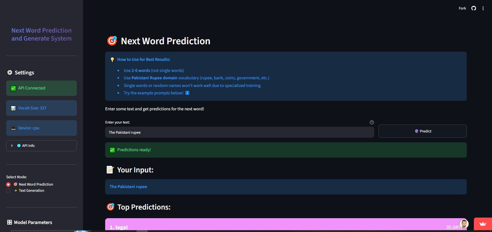
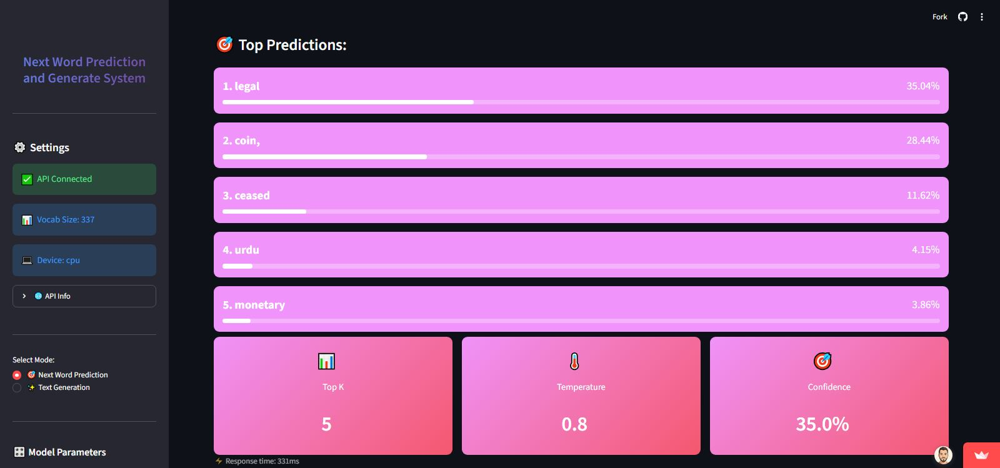
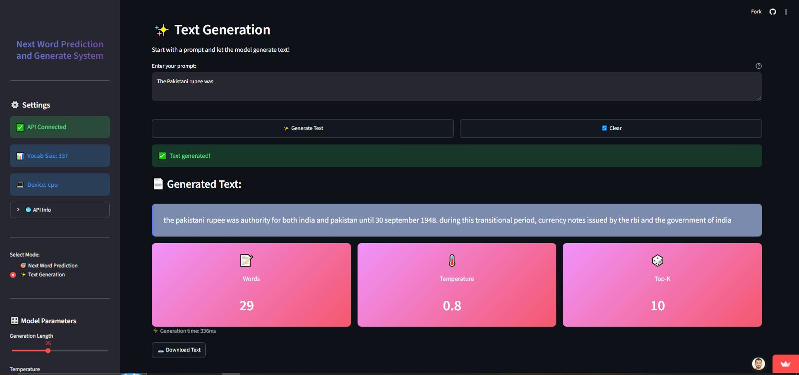

# 🚀 Next Word Prediction & Text Generation System

A production-ready **Next Word Prediction and Text Generation System** built using **PyTorch, FastAPI, and Streamlit**. This full-stack application predicts the next word in real time and generates contextual text through a modern client-server architecture.

The model was trained from scratch on a **Pakistani Rupee domain-specific corpus**, demonstrating how specialized NLP models can outperform general-purpose approaches for targeted applications.

---

## 🎯 Project Highlights

```text
🎯 94.13% Validation Accuracy
⚡ <1 Second Response Time
🧠 Custom LSTM Neural Network
🌐 Full-Stack Client-Server Architecture
🚀 Production-Ready REST API
```

---

## 🛠️ Tech Stack

| Component | Technology |
|-----------|------------|
| Backend | FastAPI |
| Frontend | Streamlit |
| Deep Learning | PyTorch |
| Model | LSTM Neural Network |
| API | RESTful API |
| Dataset | Pakistani Rupee Domain Corpus |

---

## ✨ Features

- 🔮 Real-time Next Word Prediction
- 📊 Prediction Confidence Scores
- ✍️ AI-powered Text Generation
- 🎛 Adjustable Creativity (Temperature)
- 📖 Interactive Streamlit Web Interface
- 📄 FastAPI Auto-generated API Documentation
- ⚡ Low-latency Inference

---

## 📈 Performance Metrics

| Metric | Value |
|--------|-------|
| Validation Accuracy | **94.13%** |
| Perplexity | **1.92** |
| Response Time | **< 1 Second** |
| Model Size | **~30K Parameters** |

---

## 🧠 Model Architecture

- Custom LSTM Neural Network
- 32-Dimensional Word Embeddings
- 64 Hidden Units
- ~30K Trainable Parameters
- Built entirely from scratch using PyTorch
- Trained without pretrained language models

---

## 💡 Challenges & Solutions

| Challenge | Solution |
|-----------|----------|
| Small Dataset | Data Augmentation (3×) |
| Overfitting | Early Stopping & Dropout |
| Slow Inference | Optimized Real-time Prediction |
| Deployment | Frontend-Backend Separation using FastAPI & Streamlit |

---

## 🎯 Domain-Specific NLP

Rather than using a general-purpose language model, this project focuses on a **Pakistani Rupee financial corpus** to demonstrate domain specialization.

Example inputs:

```text
"The Pakistani rupee"
"State Bank of Pakistan"
"In 1948 coins were"
```

The model produces contextual next-word predictions and generates coherent text based on financial-domain knowledge.

---

## 🔬 ML Pipeline

```text
Data Collection
        │
        ▼
Data Preprocessing
        │
        ▼
Vocabulary Building
        │
        ▼
LSTM Model Training
        │
        ▼
Model Evaluation
        │
        ▼
FastAPI Backend
        │
        ▼
Streamlit Frontend
```

---

## 📹 Demo

The demo showcases:

- ✅ Next Word Prediction
- ✅ AI Text Generation
- ✅ Confidence Scores
- ✅ Interactive Web Interface
- ✅ FastAPI REST APIs
- ✅ End-to-End Client-Server Workflow

Demo Live: https://next-word-prediction-and-generate-system-6pkhc2ayshrywvucmu3us.streamlit.app

NextWord Prediction Results:





Generation Text Result:



---

## 🚀 Future Improvements

- Transformer-based Language Models
- Larger Financial Dataset
- Docker Containerization
- MLflow Model Versioning
- CI/CD Deployment Pipeline
- User Authentication

---

## ⭐ If you found this project useful, consider giving it a Star!
